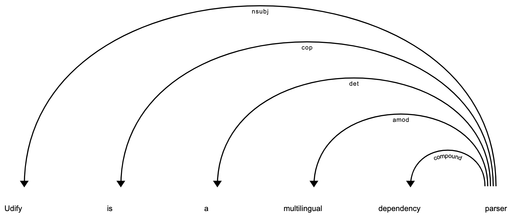
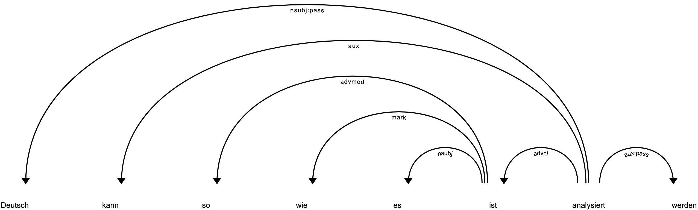

.. camphr documentation master file, created by
   sphinx-quickstart on Wed Jan 29 22:55:04 2020.
   You can adapt this file completely to your liking, but it should at least
   contain the root `toctree` directive.

.. include:: replaces.txt

Camphr
==================================

Camphr is a *Natural Language Processing* library that helps in seamless integration for a wide variety of techniques from state-of-the-art to conventional ones.
You can use `Transformers <https://huggingface.co/transformers/>`_ ,  `Udify <https://github.com/Hyperparticle/udify>`_, `ELmo <https://allennlp.org/elmo>`_, etc. on spaCy_.

.. _spaCy: https://spacy.io/

Features
~~~~~~~~

* A spaCy_ plugin - Easily integration for a wide variety of methods

* `Transformers <https://huggingface.co/transformers/>`_ with spaCy_ - :doc:`Fine tuning <notes/finetune_transformers>`, :doc:`Embedding vector <notes/transformers>`

* `Udify <https://github.com/Hyperparticle/udify>`_ - BERT based multitask model in 75 languages

* `Elmo <https://allennlp.org/elmo>`_ - Deep contextualized word representations

* Rule base matching with `Aho-Corasick <https://en.wikipedia.org/wiki/Aho%E2%80%93Corasick_algorithm>`_, Regex

* (for Japanese) `KNP <http://nlp.ist.i.kyoto-u.ac.jp/index.php?KNP>`_

Installation
~~~~~~~~~~~~

Just pip install:

.. parsed-literal::

    |install-camphr|

Camphr requires Python3.6 or newer.

Quick tour
~~~~~~~~~~

.. testsetup:: *

    import camphr
    import spacy
    cfg = """
    lang:
        name: en
    pipeline:
    pretrained: ../tests/fixtures/xlnet
    """
    nlp = camphr.load(cfg)

:doc:`Transformers for text embedding <notes/transformers>`
-----------------------------------------------------------------------------

    >>> doc = nlp("BERT converts text to vector")
    >>> doc.tensor # doctest: +ELLIPSIS
    tensor([[-0.4646,  0.6749, -3.6471,  1.9478,  0.2647, -0.5829, -1.0046, -0.4127,
            ...
    >>> doc[0].vector # token vector # doctest: +ELLIPSIS +NORMALIZE_WHITESPACE
    array([-0.46461838,  0.6748918 , -3.647077  ,  1.9477932 ,  0.26473868,
        -0.5829216 , -1.004647  , -0.41271996,  0.99519366,  1.7323551 ,
        ...
    >>> doc2 = nlp("Doc simlarity can be computed based on doc.tensor")
    >>> doc.similarity(doc2) # doctest: +ELLIPSIS
    -0.1252622...
    >>> doc[0].similarity(doc2[0]) # tokens similarity # doctest: +ELLIPSIS
    -0.049367390...

:doc:`Fine-tune Transformers for NER and text classification <notes/finetune_transformers>`
-------------------------------------------------------------------------------------------

Camphr provides training CLI built on `Hydra <https://github.com/facebookresearch/hydra>`_:

.. code-block:: console

    $ camphr train train.data.path="./train.jsonl" \
                   textcat_label="./label.json" \
                   pretrained=bert-base-cased  \
                   lang=en

    >>> import spacy
    >>> nlp = spacy("./outputs/2020-01-30/19-31-23/models/0")
    >>> doc = nlp("Fine-tune Transformers and use it as a spaCy pipeline")
    >>> print(doc.ents)
    [Transformers, spaCy]

:doc:`Udify - BERT based dependency parser for 75 languages <notes/udify>`
--------------------------------------------------------------------------

.. testsetup:: udify

    import spacy
    nlp = spacy.load("en_udify")

.. doctest:: udify

    >>> nlp = spacy.load("en_udify")
    >>> doc = nlp("Udify is a BERT based dependency parser")
    >>> spacy.displacy.render(doc) # doctest: +SKIP

.. doctest:: udify

    >>> doc = nlp("Deutsch kann so wie es ist analysiert werden")
    >>> spacy.displacy.render(doc) # doctest: +SKIP

:doc:`Elmo - Deep contextualized word representations <notes/elmo>`
-------------------------------------------------------------------

    >>> nlp = spacy.load("en_elmo_medium") # doctest: +SKIP
    >>> doc = nlp("One can deposit money at the bank")
    >>> doc.tensor
    tensor([[ 0.4673, -1.7633,  0.6011,  1.0225, -0.6563,  0.2700, -0.6024, -1.5284,
            ...
            [ 0.7888,  1.5784,  0.8037, -0.5507, -0.9697,  2.5356, -0.0293,  1.1222,
              2.8126, -0.2315,  0.5175, -1.4777, -2.8232, -3.0741, -0.8167, -0.1859]])

    >>> doc[0].vector # doctest: +ELLIPSIS
    array([ 0.46731022, -1.763341  ,  0.6010663 ,  1.0225006 , -0.65628755,
            ...
            0.13352573], dtype=float32)

See the tutorials below for more details.

Tutorials
~~~~~~~~~

.. toctree::
   :maxdepth: 1

   notes/transformers
   notes/finetune_transformers
   notes/udify
   notes/elmo
   notes/sentencepiece
   notes/rule_base_match
   notes/camphr_load
   notes/knp

