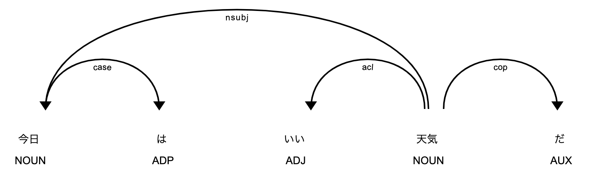
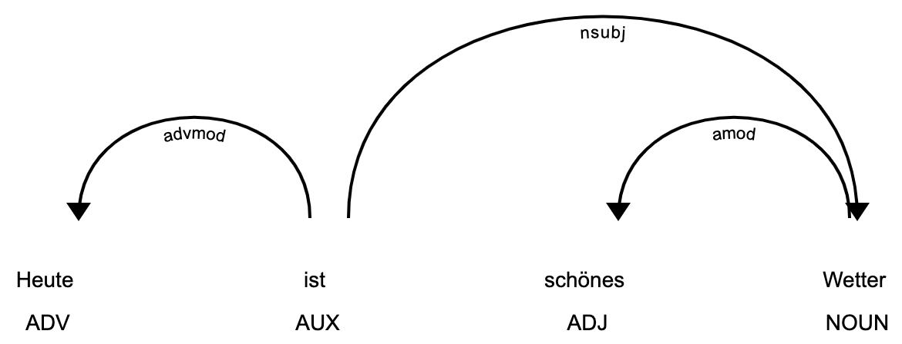

# pipelines

## Transformers Model

- BERT(mecab, juman, multilingual), 
- XLNet (sentencepiece, mecab, juman)

文章から固定長ベクトルを計算するパイプです．[BERT as a service](https://github.com/hanxiao/bert-as-service)と同じです．
[リリースページ](https://github.com/PKSHATechnology/bedore-ner/releases)から pre-trained モデルをダウンロードして，以下のようにpipでインストールしてください.  
パラメータ等全て入っています．

```bash
# BERT
$ pip install mecab-bert-model.VERSION.tar.gz
# XLNet
$ pip install sentencepiece-xlnet-model.VERSION.tar.gz
```

Example:

計算されたvectorは`doc.vector`に入っています．

```python
import spacy

nlp = spacy.load("mecab_bert_model")
doc = nlp("今日はいい天気だった")
doc.vector
```
```
tensor([ 3.6809e+00,  4.4274e+00...
```

2つの文章のコサイン類似度を計算するには, `doc.similarity`を使います．

```python
doc1 = nlp("今日はいい天気だった")
doc2 = nlp("明日は晴れるかな")
doc1.similarity(doc2)
```
```
0.5925057530403137
```

`token.similarity`を使えば，tokenごとの類似度を計算することもできます．

```python
doc = nlp("私は犬と猫が好きだ")
I, dog, cat = doc[0], doc[2], doc[4]
print(I, dog, I.similarity(dog))
print(I, cat, I.similarity(cat))
print(cat, dog, cat.similarity(dog))
```
```
私 犬 0.32778844237327576
私 猫 0.32199826836586
猫 犬 0.6300971508026123
```

tokenとspanの類似度を計算することもできます．

```python
doc = nlp("麩はこんにゃくというよりスカスカした餅のようなものだ")
hu, konnyaku, sukasukamochi = doc[0], doc[2], doc[6:9]
print(hu, konnyaku, hu.similarity(konnyaku))
print(hu, sukasukamochi, hu.similarity(sukasukamochi))
```
```
麩 こんにゃく 0.3782161474227905
麩 スカスカした餅 0.4847041666507721
```

### Multilingual BERT

Multilingual BERTを利用する場合，まずは本パッケージとmecab(またはjuman)をインストールしてください．  

```bash
$ pip install git+https://github.com/PKSHATechnology/bedore-ner
$ pip install mecab-python3
```

あとは，`camphr.models.bert_model`を呼べばOKです．パラメータ等は[huggingface/transformers](https://github.com/huggingface/transformers)からダウンロードされます．

```python
from camphr.models import bert_model
nlp = bert_model(lang="mecab", name="bert-base-multilingual-cased")
doc = nlp("私は犬と猫が好きだ")
I, dog, cat = doc[0], doc[2], doc[4]
print(I, dog, I.similarity(dog))
print(I, cat, I.similarity(cat))
print(cat, dog, cat.similarity(dog))
```
```
私 犬 0.7240002751350403
私 猫 0.7289904356002808
猫 犬 0.9425056576728821
```

### BERT Pretraining (Masked LM)

BERTの事前学習を行うこともできます.

```python
import spacy
from camphr.pipelines.trf_maskedlm import add_maskedlm_pipe

nlp = spacy.load("torch_mecab_bert_ene")
add_maskedlm_pipe(nlp)

texts = ["BERTのMasked LMを行います"]
golds = [{}]  # ラベルデータは特にないので空
optim = nlp.resume_training()
nlp.update(texts, golds, optim) # マスクデータは自動で生成され，内部で穴埋めタスクのトレーニングが実行されます
```


### Note

BERT or XLNetの出力は，[extension](https://spacy.io/usage/processing-pipelines/#custom-components-attributes)に格納されています．  

```python
doc._.trf_last_hidden_state.get()
```
```
tensor([[ 0.7485,  0.4472, -0.8713,  ...,  1.4357, -0.8676, -0.9460],
        [-0.0795,  0.6541,  0.2983,  ...,  1.4968, -1.3029, -0.7141],
        [ 0.2558, -1.0429, -0.6292,  ...,  1.8136, -1.3327,  1.2303],
        ...,
        [ 0.2756,  1.6950, -0.5470,  ...,  1.3305, -0.6078, -1.2043],
        [ 1.1879, -0.3951,  0.2410,  ...,  0.7852, -0.4615,  0.1637],
        [ 0.4241,  0.5678,  0.0574,  ...,  0.8235, -0.6994, -0.1566]])
```

propertyはspacy-transformersと統一してあります．詳しくは: https://github.com/explosion/spacy-transformers#extension-attributes


## Transformers Named Entity Recognition

BERT or XLNet を用いたNERです．  
[リリースページ](https://github.com/PKSHATechnology/bedore-ner/releases)からトレーニング済みモデルをダウンロードして，以下のようにpipでインストールしてください.  
パラメータ等全て入っています．

```bash
# BERT
$ pip install torch_mecab-bert-ene.VERSION.tar.gz
# XLNet
$ pip install torch_sentencepiece-xlnet-ene.VERSION.tar.gz
```

```python
import spacy

nlp = spacy.load("torch_mecab_bert_ene")
doc = nlp("10日発表されたノーベル文学賞の受賞者をめぐり、選考機関のスウェーデン・アカデミーが批判されている。")
for e in doc.ents:
    print(e.text, e.label_)
```
```
10日 DATE
ノーベル文学賞 AWARD
スウェーデン COUNTRY
```

大量の入力を処理したいときは，`nlp.pipe`を使いましょう．遅延評価であり，無限長の入力にも対応しています．

```python
texts: Iterable[str] = ...
docs = nlp(texts)
for doc in docs:
    ...
```

GPUを使うことでさらに高速に処理できます．(内部ではpytorchを使用しています)

```python
import torch

nlp.to(torch.device("gpu"))
docs = nlp(texts)
```

隠れ層のベクトルを利用することができます．例えば`doc.similarity`を使うと，2つの文章の類似度を計算することができます:

```python
doc1 = nlp("今日はいい天気だった")
doc2 = nlp("明日は晴れるかな")
doc1.similarity(doc2)
```
```
0.5925057530403137
```

### Training (Fine Tuning)

以下のように，`nlp.update`にデータを与えるだけでOKです．

```python
from camphr.models import trf_ner
from camphr.ner_labels.labels_irex import ALL_LABELS
from camphr.ner_labels.utils import make_biluo_labels
from spacy.util import minibatch

nlp = trf_ner(lang="mecab", labels=make_biluo_labels(ALL_LABELS), pretrained="path_to_bert")
train_data = [
    ["１９９９年３月創部の同部で初の外国人選手。", {"entities": [[0, 7, "DATE"], [15, 20, "ARTIFACT"]]}]
]

niter = 10
optim = nlp.resume_training(t_total=niter)
for i in range(niter):
    for batch in minibatch(train_data):
        texts, golds = zip(*batch)
        nlp.update(texts, golds, optim)
nlp(train_data[0][0]).ents
```
```
(１９９９年３月, 外国人選手)
```

トレーニングが済んだモデルは, `nlp.to_disk`で保存して再利用できます．

```python
# save
nlp.to_disk("bert-foo")
# load
nlp = spacy.load("./bert-foo")
```

## Regex NER

`camphr.pipelines.RegexRuler`を使うと，正規表現を用いたNER pipeを作ることができます．  
例えば，電話番号を検出したい場合は以下のようにします．  

```python
import spacy
from camphr.pipelines import RegexRuler

nlp = spacy.blank("mecab")
# create pipe
pipe = RegexRuler(pattern="\d{3}-\d{4}-\d{4}", label="PHONE")
nlp.add_pipe(pipe)

text = "もし用があれば080-1234-7667にかけてください"
nlp(text).ents
```
```
(080-1234-7667,)
```

### Compose with BERT

BERTと正規表現pipeを組み合わせて使うこともできます．特定の表現についてrecallを100%にしたいときなどに有用です．  
例えばルールベースの電話番号検出をBERTに加える場合，以下のようにします．

```python
import spacy
from camphr.pipelines.regex_ruler import RegexRuler

nlp = spacy.load("mecab_bert_ene")
pipe = RegexRuler(pattern="\d{2,3}-\d{4}-\d{3}", label="PHONE")
nlp.add_pipe(pipe)

text = "防災管理課の電話番号は03-0000-1234です"
nlp(text).ents
```
```
(防災管理課, 03-0000-1234)
```

## Udify (Parsing Universal Dependencies Universally)

[Udify](https://arxiv.org/abs/1904.02099)のパイプラインです．  
論文タイトルの通り，BERT多言語モデルでUDをします．  

### installation

https://github.com/PKSHATechnology/bedore-ner/releases/tag/v0.4.0)からtar.gzをダウンロードし，

```bash
$ pip install -U mecab_udify-0.4
```

でOKです！

### Example

```python
import spacy
import camphr.pipelines.udify
nlp = spacy.load("mecab_udify")
doc = nlp("今日はいい天気だった")
spacy.displacy.render(doc)
```



多言語モデルなので，トークナイザを付け替えればそのまま別言語で使うことができます．  
スペースで分かち書きできる言語なら，Mecabのままでいけます．  

```python
text = "Heute ist schönes Wetter"
doc = nlp(text)
spacy.displacy.render(doc)
```




### Built-In regex pipes

以下のpipeは，パッケージに同梱されています．

- postcode
- carcode

Example: 

```python
import spacy
from camphr.pipelines import postcode_ruler, carcode_ruler

nlp = spacy.blank("mecab")
nlp.add_pipe(postcode_ruler)
nlp.add_pipe(carcode_ruler)

nlp("郵便番号は〒100-0001で，車の番号は品川500 さ 2345です").ents
```
```
(〒100-0001, 品川500 さ 2345)
```

### Note

recallを100%にしたい場合は，`pipe.destructive = True`にします．分かち書きで作成したtokenを分解し，確実にマッチするようになりますが，他のパイプの性能を落とす可能性があります．

## Word2Vec, Glove, Fasttext word embedding

Word2Vec, Glove, FasttextのWord Emebeddingを使うことができます．
[リリースページ](https://github.com/PKSHATechnology/bedore-ner/releases/edit/v0.4.0.dev9)から，該当のモデルをダウンロードし，

```
$ pip install -U *tar.gz
```

でインストールしてください．モデル等全て入ります．

### Usage

```python
import spacy

nlp = spacy.load("mecab_fasttext_wikipedia")
doc = nlp("私は犬と猫を飼っている")
I, doc, cat = doc[0], doc[2], doc[4]
print(I.similarity(doc))
print(I.similarity(cat))
print(doc.similarity(cat))
```
```
0.2569612
0.28104305
0.7270736
```

## Elmo

Elmoの埋め込みベクトルを`doc.tensor`, `doc.vector`, `token.vector`, `span.vector`に格納するパイプです．  

### Installation

[リリースページ](https://github.com/PKSHATechnology/bedore-ner/releases/tag/v0.4.0.dev13)から`tar.gz`をダウンロードし, 

```bash
$ pip install **.tar.gz
```

で終わりです．

### Usage

```
nlp = spacy.load("mecab_elmo")
doc = nlp("エルモのベクトルを計算します")
doc.vector
```
```
array([ 5.1656528, -3.7939   ,  1.3086448, ..., -5.545461 , -0.8776282,
        2.1133442], dtype=float32)
```
```python
doc2 = nlp("類似度の計算ができます")
doc.similarity(doc2)
```
```
0.7309107184410095
```
```python
doc = nlp("トークン同士の類似度も計算できます")
doc[0].similarity(doc[1])
```
```
0.6428633332252502
```


## EmbedRank

[Embed Rank](https://arxiv.org/pdf/1801.04470.pdf)を用いたキーフレーズ抽出機能です．  
BERT等によって計算された埋め込みベクトルを元に,キーフレーズを抽出します.  

```python
import spacy
from camphr.pipelines.embedrank import EmbedRank

nlp = spacy.load("mecab_bert_model")
nlp.add_pipe(EmbedRank(vocab=nlp.vocab))
text = "今日はいい天気だ"
doc = nlp(text)
doc._.embedrank_keyphrases
```
```
[いい天気, 今日, 天気]
```

## EntityRuler

spaCyに実装されているルールベースNERです．
https://spacy.io/api/entityruler

### Person NER

mecabのタグ情報を元に，人名抽出をします．

```python
from camphr.models import person_ruler

nlp = person_ruler()
text = "2019年11月8日に高松隆と東京タワーに行った"
nlp(text).ents
```
```
(高松隆,)
```

## Date NER

ルールベースで日付を抽出するNERパイプラインです．

```python
from camphr.models import date_ruler

nlp = date_ruler()
text = "2019年11月8日に高松隆と東京タワーに行った"
nlp(text).ents
```
```
(2019年11月8日,)
```

## KNP NER

[KNP](http://nlp.ist.i.kyoto-u.ac.jp/index.php?KNP)を使ったNERです．

```python
from camphr.models import knp_ner

nlp = knp_ner()
text = "2019年11月8日に高松隆と東京タワーに行った"
nlp(text).ents
```
```
(2019年11月8日, 高松隆, 東京タワー)
```
